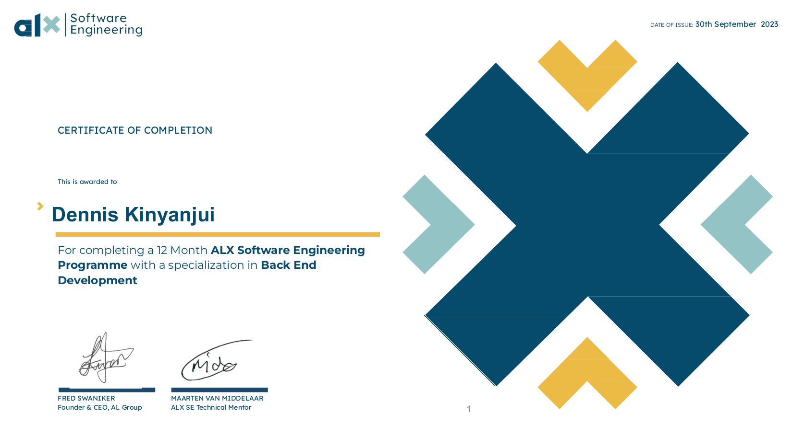
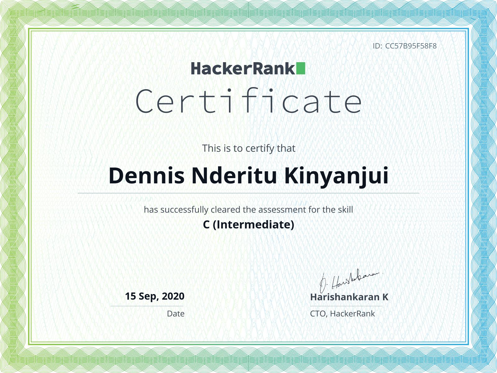
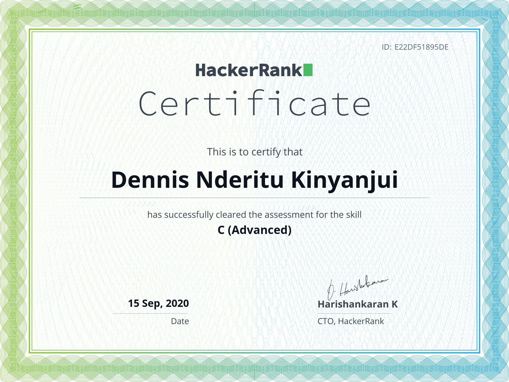
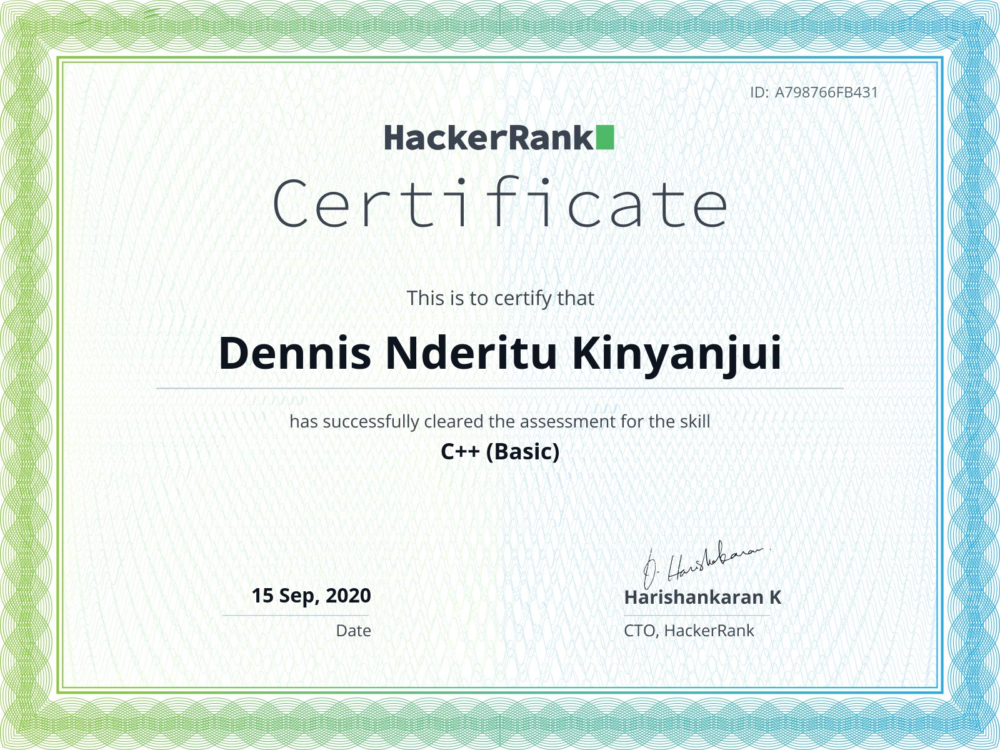
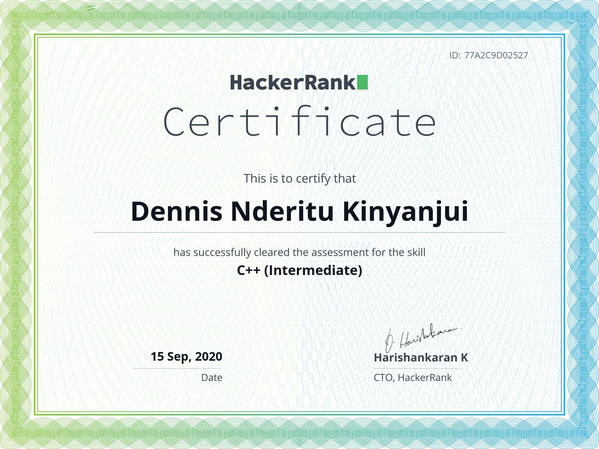
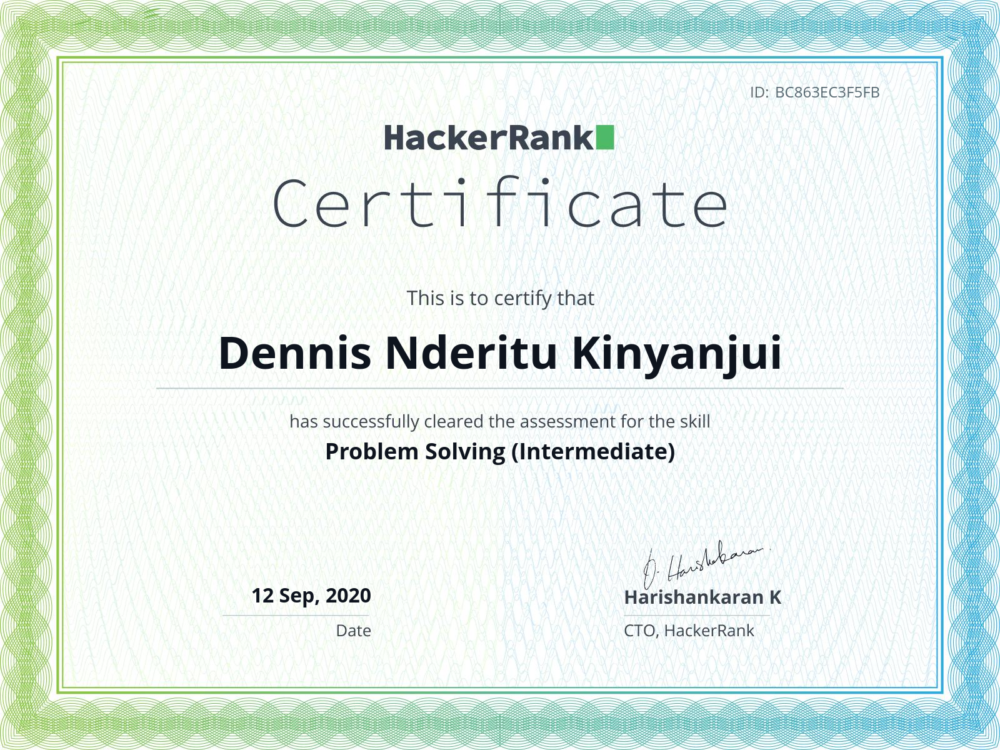
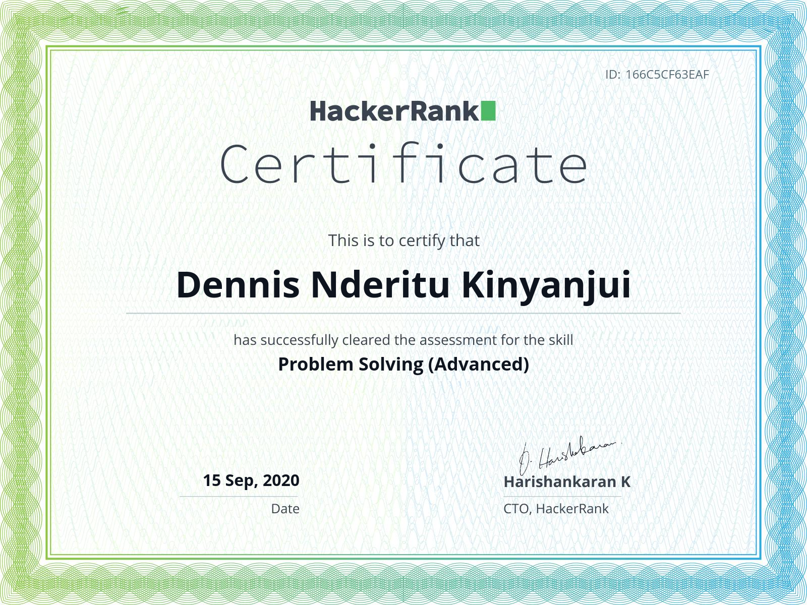
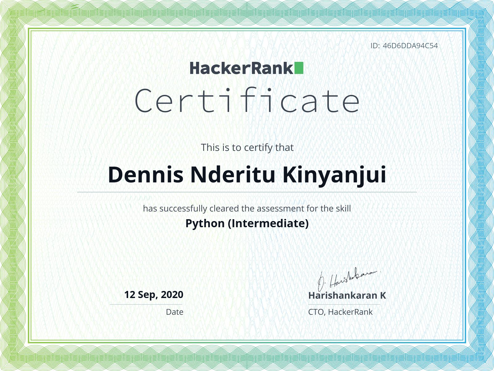
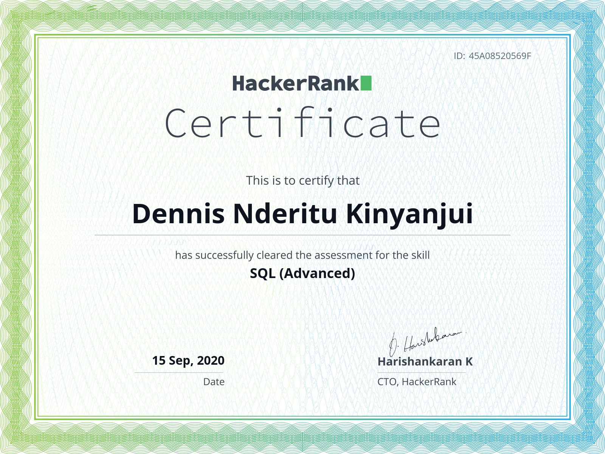
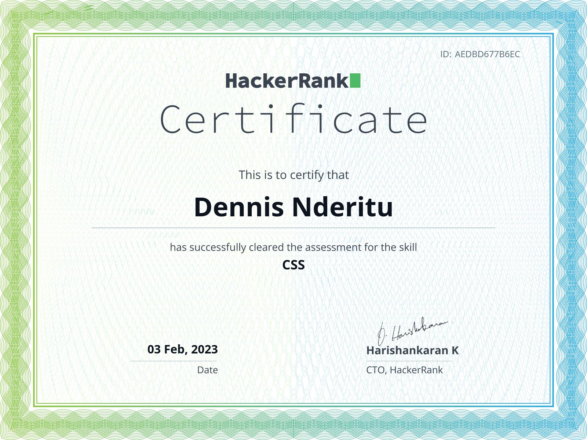

<h1 align='center'>"Dev Nderitu Here"</h1>

I enjoy programming and web development.Python Developer. Problem Solver

<h1 align="center"> WELCOME TO MY WORLD!  </h1>
<h3 align="center">

<!-- <h1 align="left"> </h1>
  
 -->

<!-- 
 

 -->

 
<h4>
<ul align="left">
     <li>Completed The ALX Software Engineering Bootcamp </li>  
</ul>

</h4>

### Active Repositories

| Repository | Description |
| --- | --- |
| [AlX-low_level_programming](https://github.com/dennisnderitu254/alx-low_level_programming) | C programming, functions, pointers, data structures (stacks/queues, singly/doubly linked list, hash tables, binary trees), algorithms(sorting, Big O), bit manipulation, recursion, variadic functions, memory management, heap/stack, static/dynamic libraries |
| [Alx-system_engineering-devops](https://github.com/dennisnderitu254/alx-system_engineering-devops) | Linux permissions, redirections, syscalls, loops, conditions and parsing, processes and signals, SSH |
| [Alx-high_level_programming](https://github.com/dennisnderitu254/alx-higher_level_programming) | Python Loops and iterators, functions, test driven development, data structures and algorithms|

<h3 align="center"> Tools & Technologies</h3>

   
 
    
 
   
 

<h3 align="center"> Major projects worked on in order:</h3>

| Project name | Description |
| --- | --- |
|[Printf](https://github.com/codebyrugi/printf)| The program is designed to mimic the printf function in C.|
|[Simple_Shell](https://github.com/dennisnderitu254/simple_shell)| The program is designed to mimic the abilities of a simple shell. |
|[Monty](https://github.com/dennisnderitu254/monty) | Stacks, Queues - LIFO, FIFO |
|[Sorting Algorithms](https://github.com/dennisnderitu254/sorting_algorithms) | Sorting Algorithms Implementation in C|
|[RSA-Factoring-Challenge](https://github.com/dennisnderitu254/RSA-Factoring-Challenge) |RSA Factoring Challenge|
|[AirBnB Clone](https://github.com/dennisnderitu254/AirBnB_clone) | AirBnB Clone Command Line Interface |
|[Binary Trees](https://github.com/dennisnderitu254/binary_trees) | Binary Trees |
|[Search Algorithms](https://github.com/dennisnderitu254/alx-low_level_programming/tree/master/0x1E-search_algorithms) | Search Algorithms |

 

### Let's Connect 

 
 <a href="https://www.linkedin.com/in/dennis-kinyanjui-a35a9510b/">.   </a>
 <a href="https://www.instagram.com/dennisnnderitu_/">.     </a>
 <a href="https://www.twitter.com/devnderitu/">.     </a>

<!-- <h2 align="left"></h2> -->
<!--

  
  
  

  
  
  

  
  
  

  
  
  

  
  
  

  
  
  

 -->

---

<!--
